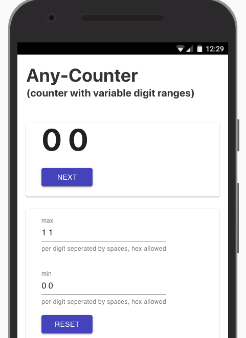
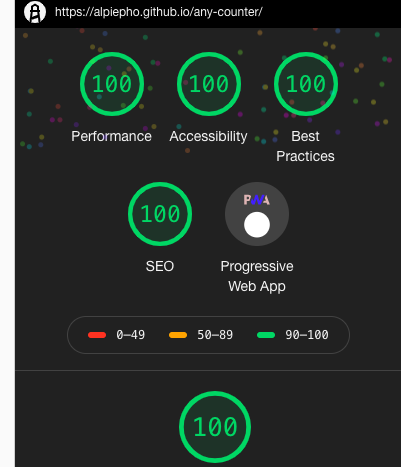

Deployed on [Netlify](https://elated-hypatia-4f4711.netlify.com)

Deployed on [GH-Pages](https://alpiepho.github.io/any-counter/)

## Any Counter PWA

### What it is

This is a simple PWA (Progressive Web Application) written in React.js and the Server Side Rendering framework Gatsby.js. This was designed using the Google Material UI React package.

This is hosted on GH-Pages [here](https://alpiepho.github.io/any-counter/)

### So, Why?

What is the purpose of this application?

There are several problems that can be solved with a counter that uses different ranges for the digits. For example, if you enter all 1s for max, then you have a binary counter. If you enter 'FF', then you have a hex counter.

A more complex example is min set to '5 0 0' and max set to '9 59 59' then you have a time counter from 5 mins to 10 mins.

This algorithm was originally used to 'count' thru the permutations of letter from a phone. '2' shows 'abc', '7' shows 'pqrs'. The ranges are different. This algorithm was used to map from integers to letters. With min set to '0 0', and max to '2 3', the count would be '0 0', '0 1'...'2 3'. This can easily be mapped to 'ap', 'aq'...'cs'.

### Addition of Run and WebAssembly

The 'run' feature lets you free run the counter. The 'cycles' allows
running multiple cycles of either engine (Javascript or WebAssembly) for
each display loop (controlled by the run rate)

Please see the [README.md](./wasm/README.md)
 in the wasm directory for details on how C code
was compiled into a .wasm file.

In limited testing, there does not seem to be siginifiant peroformance
improvement withe the WebAssembly version. This may be due to the
amount of Javascript code used ot interface with the wasm functions.
We needto investigate, but at least there is a base example of using
WebAssembly in this project.

## Success!!!

I have been exeprimenting with LightHouse testing for a few weeks. I noticed the Look/Feel of this tool changed with a recent update of Chrome. I also saw a cool easter egg when I hit all 100s for this app (sorry, can't show the animated fireworks):

### Follow up after WebAssembly Added

Unfortunately, we lost the all 100 score, with the performance score dropping to 99. This is due to
150ms load time of the Wasm and Javascript wrappers for WebAssembly. it does look like the current
technique using Enscriptem produces a lot of boiler plate javascript. Perhaps some of the other
WebAssembly methods can reduce this.

## A Collection of Buzzwords

This small concept project has turned into an example of several technologies,
or "Buzzwords":

- HTML
- CSS
- Javascript
- React
- Gatsby
- Material UI
- PWA (progresive web apps)
- JAMStack
- WebAssembly
- GH-Pages
- Netlify
- Lighthouse

## Whats left TODO

This is a list of some other ideas:

- Create Bootstrap version
- Use this for other apps:
  - A clock timer
  - A date count down
- wasm with C processes
- wasm with Rust
- Go the other way and use AWS or Azure services for counter

## Updates for GitHub security issues

- added eslint-utils directly to package.json (is a deep dependency)